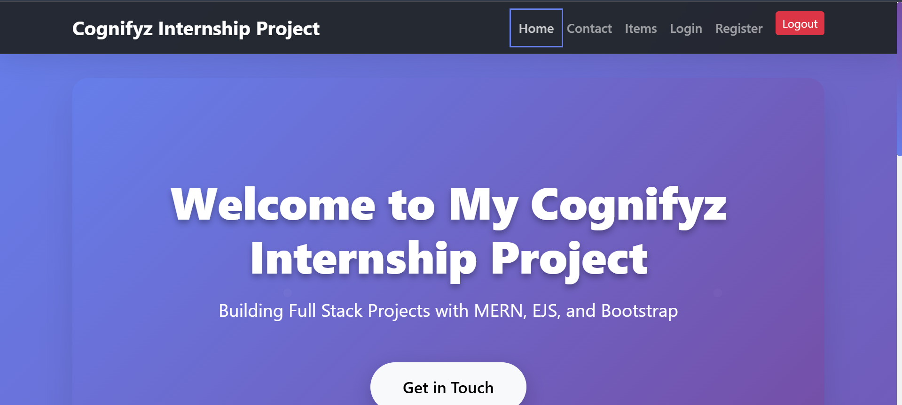
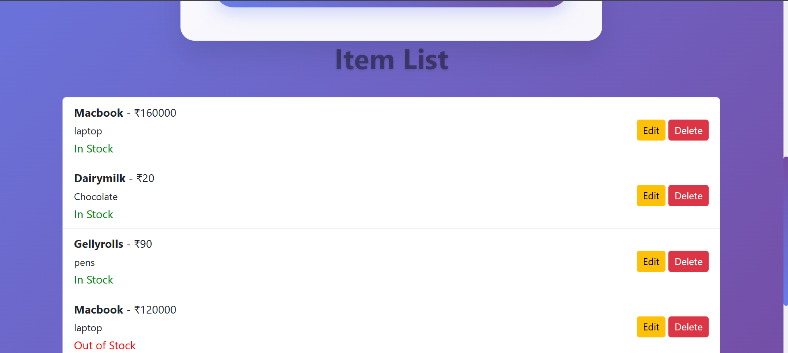

# 🚀 Cognifyz Full Stack Internship Project

> **Built with 💻 + ☕ + a lot of console.logs.**

Hey there! This is the brainchild of my internship at **Cognifyz Technologies**. It’s a full-stack web application built using the **MERN stack** (well, technically ME\*N, with a lil sprinkle of EJS instead of React).

Think of this as a playground where I explored form handling, server-side rendering, MongoDB magic, authentication with JWT, and built my very own CRUD empire.

---

## 🧠 What This Project Does

* 📥 Registers users
* 🔐 Logs them in securely (with JWT!)
* 📋 Lets them perform full CRUD operations on "Items"
* 📩 Has a contact form (because professional websites need those)
* 🛡️ Protected routes so no random invaders allowed
* 🤹 And it's all tied together like a beautiful Bootstrap-wrapped burrito

---

## 🛠 Tech Stack

* **Frontend:** HTML, CSS, JavaScript, EJS Templates, Bootstrap 5
* **Backend:** Node.js, Express.js
* **Database:** MongoDB + Mongoose
* **Auth:** JSON Web Tokens (JWT)

---

## 📦 Folder Structure (a tour)

```
cognifyz-fsd-internship/
├── server.js                 # Starting point of everything
├── .env                     # Shhh... secrets live here
├── views/                   # EJS files aka the face of the project
│   ├── register.ejs         # User sign-up page
│   ├── login.ejs            # User login page
│   ├── items.ejs            # CRUD interface
│   ├── contact.ejs          # Contact form page
│   ├── layout.ejs          # Layout template
|   ├── error.ejs           
|   └── index.ejs           
|
├── public/
│   ├── css/styles.css       # Styling sauce
│   └── js/                  
│       ├── validate.js      # Client-side validation logic
│       ├── router.js        # SPA magic (well, kinda)
|       ├── auth.js
│       └── api.js           # Handles fetch requests
├── routes/                  # Express routes
│   ├── index.js             # Home & contact
│   ├── api.js               # Item CRUD
│   └── auth.js              # Login/register routes
├── controllers/             # Logic lives here
│   ├── formController.js
│   ├── apiController.js
│   └── authController.js
├── models/
│   ├── User.js              # User schema
|   ├── Contact.js
│   └── Item.js              # CRUD item schema
├── middleware/   
│   └── auth.js      # Protect routes
└── utils/
    └── db.js                # MongoDB connection helper
```

---

## 🧪 Tasks Completed (and Conquered)

### 🟢 **Level 1 - Rookie Zone**

* **Task 1:** Created basic HTML form using EJS.
* **Task 2:** Added server-side validation and basic inline styling. Data printed to console (baby steps).

### 🟡 **Level 2 - Styling & Routing**

* **Task 3:** Styled app with Bootstrap, made it responsive.
* **Task 4:** Implemented client-side routing (SPA-ish behavior).

### 🟠 **Level 3 - CRUD & Auth Mastery**

* **Task 5:** Built full CRUD APIs for items. Displayed on frontend.
* **Task 6:** Integrated JWT authentication. Registered, logged in users can access CRUD routes.

> Not just functional. It’s snazzy too.

---

## 🔑 Features

* **JWT Auth:** Tokens stored in localStorage like a pro.
* **SPA Behavior:** Feels like a Single Page App (thanks to some clever JS).
* **Responsive Design:** Works on desktop, tablet, and phones (even the cracked ones).
* **Secure Passwords:** Hashed using bcrypt.
* **Contact Form:** For those professional vibes.

---

## 💻 How To Run Locally

1. **Clone the repo**

```bash
git clone https://github.com/TanishaD21/cognifyz-fsd-internship.git
cd cognifyz-fsd-internship
```

2. **Install dependencies**

```bash
npm install
```

3. **Set up `.env` file**

```env
PORT=3000
MONGODB_URI=your-mongodb-connection-uri
JWT_SECRET=your-secret-key
```

4. **Run the server**

```bash
npm start
```

5. **Visit in browser**

```
http://localhost:3000
```

---

## 📸 Output Screenshots


### 🔐 Landing Page


### ✅ Items CRUD


### 🧠 JWT in DevTools


---

## 🧑‍🎓 About Me

* Name: **Tanisha** (aka tani 🌻)
* Role: Full Stack Intern @ Cognifyz
* Fav line of code: `res.status(200).json({ success: true })`

---

**Peace, Push & Ship it. ✨**

> "From zero to full-stack hero in 6 tasks."
